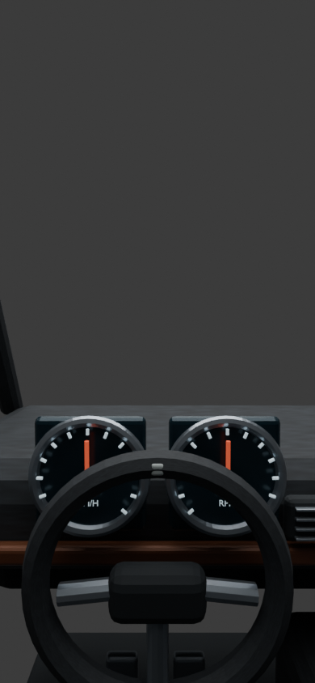

# Racing Royal: Tirana city courses and seated cockpits

Racing Royal now uses the current Tirana Streets WORLD, neighbourhood building
cells, reference façades, aged housing, native landmarks and shared street detail.
The update is based on main including the greenery and city streaming changes in
060f53e. Geographic coordinates and the original vehicle GLBs are retained.

| Course | Previous lap | Updated lap |
| --- | ---: | ---: |
| Skënderbej | 1.88 km | 5.20 km |
| Blloku | 1.06 km | 5.29 km |
| Lana | 1.45 km | 5.25 km |
| Pyramid | 0.98 km | 5.23 km |
| Nënë Tereza | 0.88 km | 4.87 km |

The five IDs remain compatible with the lobby and multiplayer queue. The old
Lana–Pyramid Grand remains available as a labelled Classic Grand. New routes are
closed paths on connected streets in the checked-in OSM snapshot, with no invented
connectors or geographic scaling. They are racing courses, not legal itineraries.
Event ribbons follow the source widths, capped at 12 m. All sample corners are
retained. Adjacent-road projection uses the current route segment to prevent lap
gates jumping to a nearby carriageway. Browser and server share this code.

Cars keep their authored metre dimensions; karts use a 2.7 m length. Collision
footprints now account for body width, length and heading. Start-grid spacing is
measured in metres. Races allow 25 minutes; room expiry and career missions use
the longer duration. The first qualifier allows 22 minutes. Existing saved best
times are retained, so older personal records may be shorter than new-course runs.

## Driver view

The vehicle collection's `driverSeat` is a pelvis/seat socket. The camera now sits
0.62 m above that socket, with the native asset transform applied. Military cars
and karts retain their authored eye sockets. Driver mode loads the fitted Blender
cabin, and hides the local exterior's materials so opaque source glass cannot
cover the camera. Chase mode restores the original exterior and camera behaviour.
Steering and speed/RPM needles animate. The camera remains attached to its seat
through body motion. Portrait framing keeps the road above the dashboard.

Five original interior families cover the fleet: sedan, sport, SUV, armored and
open kart. They include packed leather texture, dashboard, instruments, steering,
seats, trim, door panels, pedals and centre console as appropriate. These are
fitted game interiors, not scanned or exact manufacturer interiors.

- Editable sources: `assets-source/racing-cockpits/*.blend`
- Runtime exports: `webapp/public/assets/kart-royale/cockpits/*.glb`
- Rebuild: `blender -b --python tools/blender/racing_cockpits.py`
- Route authoring: `node tools/build-racing-city-circuits.mjs`

This image is a Blender render of the cabin, not a browser screenshot or a rendered
Tirana race. The hosted chat browser reports GL_VENDOR/GL_RENDERER as Disabled and
cannot create a WebGL context. The app uses Tirana Streets' high-performance then
standard-context startup fallback; it cannot override a browser's graphics policy.

## Validation

- Production Vite build and game-pack generation.
- Source-edge continuity, closed unique routes, widths and exact lengths.
- Full three-lap races, sequential gates and metre-scale vehicle contacts.
- Original military GLBs and their low-detail variants.
- Blender export structure, packed textures and animated pivot nodes.
- Driver-eye transform, exterior visibility and chase restoration.
- Multiplayer authority, room isolation, reconnect, completion and rematch.

The repository-wide TypeScript check also reaches pre-existing declaration and
lighting type errors outside Racing Royal. Live WebGL visual/performance testing
on a phone remains necessary; no browser frame-rate claim is made here.

Map data © OpenStreetMap contributors, ODbL 1.0, as attributed in Tirana Streets.
