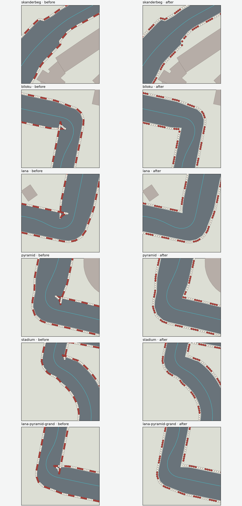
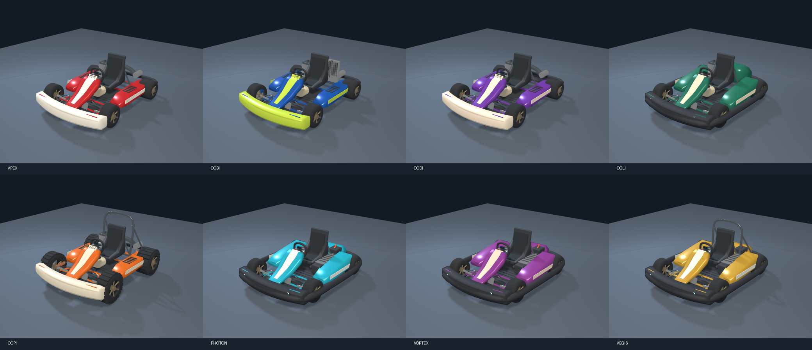

# Racing Royal: corner barriers and modern kart fleet

The old centreline offsets folded back across themselves at tight inside turns.
Tyre spacing was also smaller than their full diameter. Checking clearance only
at centreline samples did not catch actual tyre footprints inside asphalt or
nearby buildings.

The new layout takes the union of the exact triangles rendered for the asphalt,
offsets its exterior and hole boundaries, and tests complete tyre footprints
against asphalt, buildings and other tyres. The boolean operation uses a 1 mm
snap to avoid coincident-edge numerical failures; final clearance uses the
original unsnapped triangles. Kerbs follow the same union, removing their crossed
inside-corner spurs too. Both layers use spatially culled instance batches.

## Full circuit inspection

One complete fixed-step AI inspection lap was driven on every circuit through
five ordered gates, including the starting-line crossing. All six completed.
The images show source geometry and offline GLB renders; they are not browser
screenshots or physical-phone tests.

| Circuit | Tyres entering asphalt before / after | Tyres entering buildings before / after | Inspection lap |
| --- | ---: | ---: | ---: |
| Skënderbej | 130 / 0 | 0 / 0 | 134.1 s |
| Blloku | 89 / 0 | 0 / 0 | 72.8 s |
| Lana | 289 / 0 | 0 / 0 | 126.4 s |
| Pyramid | 112 / 0 | 0 / 0 | 67.2 s |
| Nënë Tereza | 96 / 0 | 16 / 0 | 90.4 s |
| Lana–Pyramid Grand | 199 / 0 | 1 / 0 | 139.3 s |

All 24,081 final ground-level tyres have non-overlapping footprints and clear
the asphalt and building solids. A separate Shapely audit confirms asphalt
clearance and neighbour spacing. Lana's inspection driver briefly contacts the
existing mathematical road boundary (49 fixed-step frames); it completes the
lap. This change does not alter AI driving or the collision corridor.



## Eight existing IDs, eight updated constructions

| Existing kart | Updated visible construction |
| --- | --- |
| Apex Sprint | Open tubular chassis, sculpted fairings, petrol engine, flat slick tread |
| Eagle Shifter | Tall radiator and coolant hose, gear lever, front brake discs |
| Illyrian Drift | Low diffuser and broad rear slicks |
| Besa Endurance | Perimeter bumper, covered engine, seat runners and lamps |
| Dajti Cross | Knobby tread, rounded roll hoop, bracing, visible dampers and coils |
| Photon GT | Battery modules, inverter, real motor layout and running lights |
| Vortex R | Electric sport bodywork, low articulated diffuser |
| Aegis XR | Electric endurance bodywork, perimeter protection and roll hoop |

The models retain the game's IDs, performance values, seat/hand sockets and
steering/wheel pivots. Realistic proportion and mechanical references replace
the previous block-shaped bodies, doughnut wheels and fictional thrusters.
Electric boost feedback now comes from the tyres; combustion exhaust comes from
the updated petrol exhaust position. Existing arcade suspension remains.

The GLBs have no external texture dependencies. High versions contain
13.2–23.2k triangles; mobile versions contain 6.5–9.9k. Material batching limits
each kart to 30–40 mesh draws. The URL revision refreshes existing phone caches.
These are mesh budgets, not measured phone frame rates. The common adapter uses
the same high-resolution fit for its matching LOD to keep wheel contacts fixed.



## References

Inspected on 2026-09-13. Reference photographs inform construction; the game
geometry, race numbers and liveries are original, without manufacturer branding.

- [Tony Kart Racer 401 T](https://www.tonykart.com/telai-racer-401T_en.php): bent tubular chassis, M11 front fairing and nose, M10 side/rear protection, radiator, brake and steering details. The official front image was inspected directly.
- [Sodi RSX2](https://www.sodikart.com/fr-fr/karts/rental/rsx2-43.html): low electric rental kart, enclosed modules, perimeter protection, adjustable seating and steering. The official three-quarter image was inspected directly.
- [Sodi SR5](https://www.sodikart.com/fr-fr/karts/rental/sr5-30.html): covered floor and fuel tank, adjustable pedals and rental bodywork.

## Reproduce and review

All 90 regression checks pass and the standalone Racing Royal production build
succeeds. Results are saved in `validation/racing-corners/tests.txt`.

```sh
node tools/build-modern-racing-karts.mjs
node tools/verify-racing-barriers.mjs docs/validation/racing-corners /tmp/racing-corner-geometry.json
python tools/render-racing-corners.py /tmp/racing-corner-geometry.json docs/validation/racing-corners/corners-before-after.png
PYOPENGL_PLATFORM=egl python tools/render-racing-karts.py docs/validation/racing-corners/modern-fleet.png
node --test test/racingModernFleet.test.mjs test/racingRoadFeel.test.mjs test/racingPaceUpgrade.test.mjs test/racingKartDynamics.test.mjs test/racingManualDrive.test.mjs test/racing-precision.test.mjs test/racingTouchControls.test.mjs test/racingCityUpgrade.test.mjs test/racingKartRemake.test.mjs test/racingRoyalTirana.test.mjs
cd webapp
node_modules/.bin/vite build --config vite.kart.config.js
```

Python inspection uses NumPy, Shapely, SciPy, Matplotlib, Pillow, trimesh and
pyrender/EGL. It is separate from the production runtime.

The portrait preview includes all six tracks and eight karts using the same
TypeScript mesh source, physics, controls, kerbs, humps and validated tyre
positions. City scenery is simplified and batched; preview tyre coordinates are
rounded to 1 mm for transfer size. Drag the garage model to inspect it.

Browser interaction QA remains blocked: the configured local game URL returns
`ERR_BLOCKED_BY_CLIENT`. The existing broader kart TypeScript check still has ten
missing declaration errors in imported city/social modules. The changed racing
modules report none. The production build retains the existing large city chunk
warning. Phone frame rate, real touch layout and live multiplayer need review on
the deployed preview before release.
