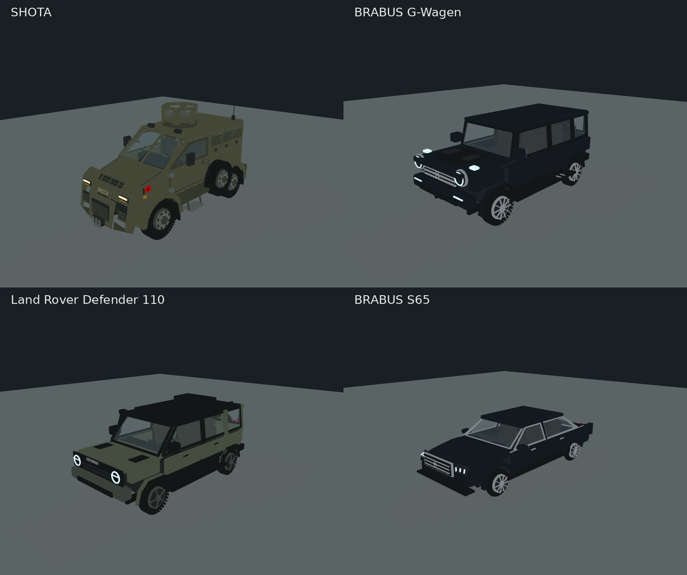

# Racing Royal: military and armoured vehicles

The existing Racing Royal garage and Kart Career now offer nine classes. The
original five kart IDs and their handling are retained. The four additions are
available to local races, career cups/missions, and the existing authoritative
multiplayer service through the same shared catalog and appearance messages.

| ID | Vehicle | Model details |
| --- | --- | --- |
| `shota` | SHOTA | Albanian protected 4×4, angular nose, split windscreen, side-mounted spare wheels, custom six-seat van interior |
| `brabus-g` | BRABUS G-Wagen | Black G-Class inspired armoured SUV, round LED lamps, exposed hinges, rear spare, side exhausts, five-seat interior |
| `defender` | Land Rover Defender | Olive Defender 110 inspired expedition SUV, roof rack, raised intake, rear spare, five-seat interior |
| `brabus-s65` | BRABUS S65 | Black W222/S65 inspired armoured sedan, long bonnet, chrome grille, quad exhausts, five-seat interior |

These are original visual reconstructions with estimated proportions, not
manufacturer CAD or certified armoured configurations. SHOTA retains the custom
van seating from the earlier model. The other interiors are custom game layouts.
The S65 “bulletproof” designation describes the requested game variant; shield,
speed, braking and handling numbers are arcade balancing values.

## Play

Open Racing Royal, choose a vehicle from **Your vehicle**, then start a local race
or join/create an online race. The same device preference is available in
**Kart Career → Vehicle**. The existing camera control switches between chase
and the left-hand driving seat. Left/right steering, braking, boost, shields,
weapons, lap validation and server authority use the existing simulation.

Colours are authored per new vehicle. Original karts keep their paint selector.
The physical collision footprint is unchanged. Only the visual instance is
fitted to the existing 2.7-unit vehicle length so the new cars fit the circuits.

## Editable models and export

- `webapp/scripts/military-vehicles/{shota,convoy}.ts`: editable Three.js geometry.
- `webapp/scripts/military-vehicles/textures.py`: deterministic original CC0 PBR
  paint, rubber and fabric maps, 256×256. Requires Python, Pillow and NumPy only
  when regenerating the checked-in texture sources.
- `webapp/scripts/build-military-vehicles.mjs`: glTF 2.0 export with embedded
  textures, badges and the existing licensed Albanian flag. Run
  `npm run generate:military-vehicles --prefix webapp` after installing the
  webapp dependencies. No texture CDN or external asset API is used in gameplay.
- `webapp/public/assets/kart-royale/military/`: eight self-contained GLBs, full and
  opponent LOD for each vehicle; `manifest.json` records size, triangles and bounds.

The GLBs use metres, Y up and +Z forward. Separate `wheel_fl`, `wheel_fr`,
`wheel_rl`, `wheel_rr`, `steer_fl`, `steer_fr`, `body`, `interior` and
`steering_wheel` nodes preserve the driving rig. LODs omit the interior and small
details. Static geometry is batched by material while wheel pivots stay separate.
`vehicleAssetAdapter.ts` scales the model, wheel radius and actual eye position
together. LODs use the full model's fit to avoid scale jumps.

In Blender, use **File → Import → glTF 2.0** to edit any GLB. Alternatively run:

```sh
blender --background --python webapp/scripts/military-vehicles/blender_import.py -- shota
```

Replace `shota` with any ID in the table. The helper creates a separate scene and
saves `<id>.blend` alongside the GLB, retaining embedded materials and pivots.
Blender was unavailable in the authoring environment; the helper has been syntax
checked but not executed in Blender. The committed models were generated by the
Three.js exporter.

## Credits and references

Original model source and geometry follow the repository's MIT license. The
new procedural maps are CC0 1.0; see `military/TEXTURE-LICENSE.txt`.
The SHOTA flag reuses flag-icons 7.3.2 (MIT), credited in the parent
`ATTRIBUTION.md`. Badge glyphs derive from Three.js's helvetiker font; its
permission notice is retained as `military/FONT-LICENSE.txt`.
Vehicle names identify visual references; no manufacturer affiliation is implied.

- [TIMAK SHOTA announcement](https://www.linkedin.com/posts/timak_shota-madeinalbania-activity-7220097544117178369-dh1s)
- [Janes SHOTA profile](https://www.janes.com/defence-intelligence-insights/defence-news/land/eurosatory-2024-timak-showcases-first-protected-patrol-vehicle-designed-in-albania)
- [BRABUS INVICTO exterior reference](https://www.facebook.com/brabus/videos/invicto-pure-vr6-erv-armoured-vehicle/903371470186572/)
- [Land Rover Defender 110 video gallery](https://www.landrover.co.uk/defender/defender-110/110-video-gallery.3.html)

## Validation

```sh
node --test test/racingMilitaryVehicles.test.mjs test/racing-precision.test.mjs test/kartRoyale.test.mjs
npm run build --prefix webapp
node webapp/node_modules/typescript/bin/tsc -p webapp/tsconfig.kart.json --noEmit
```

The tests check GLB structure, embedded images, full/LOD pivots, seat/scale fitting,
all four vehicles completing races, screen-direction steering, braking, nine
distinct vehicle classes, shield/ammo behaviour and multiplayer appearance
persistence through reconnect. The broader multiplayer suite covers server
authority, isolation, race completion, rematch and cleanup.

The project TypeScript check has four existing TS7016 errors in Tirana Social
and SharedGameCast imports; the unchanged base commit produces the same errors.
The preview browser can exercise the selector but cannot create a WebGL context.
All four exported models and their portrait driving-seat positions were also
inspected with a separate offscreen renderer. Live Three.js garage/cockpit and
phone frame-rate verification remain manual.


