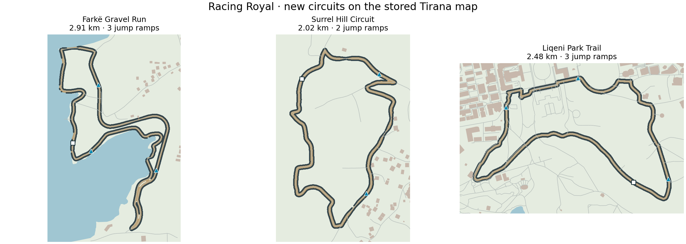

# Racing Royal: rural circuits and free driving

Racing Royal now has nine circuits. The three new routes follow closed loops
in the checked-in Tirana road/path data, using the same map and regional terrain
as Tirana Streets. Their original edges and source attribution are retained in
`rural-routes.mjs`; the runtime does not request external maps.

| Circuit | Length | Surface | Jump ramps |
| --- | ---: | --- | ---: |
| Farkë Gravel Run | 2.91 km | Gravel lakeside paths | 3 |
| Surrel Hill Circuit | 2.02 km | Asphalt foothill roads | 2 |
| Liqeni Park Trail | 2.48 km | Dirt park paths | 3 |

Course widths taper around buildings and shorelines. The clearance pass checks
the actual joined road edges, including inside-corner projections; tyre placement
also excludes water. Existing city circuit IDs and saved kart choices remain
compatible. Gravel and dirt reduce grip, and suspension follows regional ground
height. These are closed game circuits derived from the stored map.

## Explore and drive

Free roam starts in the selected kart at the city centre, Blloku, Liqeni, Farkë
or Surrel. It uses the full shared city scene, with no opponents, countdown,
race ribbon, lap gates, results or time limit. The local map follows the kart
through surrounding streets. Building and lake footprints use spatial indexing
and swept contact checks; recovery returns to the last safe road position.
The free-driving context is selected locally by the mode, never by an input
packet, so multiplayer races keep their authoritative boundaries and lap rules.

Jump ramps share one profile between rendering and fixed-step physics. They sit
on straight approaches with a checked landing corridor. Crossing the lip in the
correct direction launches the kart, grants a short turbo and energy, and follows
a gravity-driven arc into a suspension landing. An airborne kart cannot collect
ground boost pads; missed, backward or cooldown crossings do not grant a launch.
Camera height, kart placement, effects and shadows follow the terrain and jump.

Holding BRAKE first stops the kart. Keeping it held for 0.4 seconds at rest
engages reverse, capped at 7 m/s. Release or GAS cancels the reverse request.
AI braking and simultaneous GAS/BRAKE do not select automatic reverse. The
existing explicit keyboard reverse action is still supported.

Boost, drift-charge tiers and pickup flashes now appear inside the BOOST
button. The central feedback overlay is removed. KM/H sits lower, above the
portrait controls, and displays an R while reversing; BRAKE becomes REV.

## Validation

- All 117 regression tests pass, including the full nine-circuit AI matrix and
  real local multiplayer clients exercising authority, reconnect, finish,
  rematch and cleanup. See [tests.txt](validation/racing-rural/tests.txt).
- All 54 drivers in the dedicated rural matrix completed three laps and all
  13 ordered gates: six different karts × three tracks × three difficulties.
  The slowest finish is under the normal 700-second race limit. See
  [races.json](validation/racing-rural/races.json).
- Independent Shapely analysis of the actual road triangles finds no road area
  inside water or buildings on any new circuit. All 11,822 ground-level tyres
  clear road, buildings and water; minimum centre spacing exceeds 1.15 m. See
  [geometry.json](validation/racing-rural/geometry.json).
- Behavior tests cover real takeoff/landing, missed jumps, held-brake reverse,
  free intersection traversal, no race progress during exploration, collision
  tunnelling, and the production touch controls' boost/reverse states.
- The standalone Vite production build succeeds. It retains the existing large
  shared-city bundle warning. See [build.txt](validation/racing-rural/build.txt).
- The kart TypeScript check still reports 12 missing declarations in imported
  city/social modules. It reports no errors in the changed racing modules. See
  [typecheck.txt](validation/racing-rural/typecheck.txt).
- Interactive browser verification is blocked by `ERR_BLOCKED_BY_CLIENT` on
  the configured local game URL. Real phone layout/frame rate and deployed
  multiplayer have not been verified in this environment.



The portrait preview uses production physics, controls and kart meshes, plus
four selectable areas (city centre and the three new circuits). Its scenery is
reduced to each area's neighborhood to fit the inline transfer budget. The game
itself loads the full city for free exploration.

## Reproduce

Install the repository and webapp dependencies before running the checks.
Python tools need NetworkX, Shapely, NumPy, SciPy and Matplotlib.

```sh
node tools/build-racing-rural-routes.mjs
node tools/audit-racing-rural.mjs
node tools/verify-racing-rural.mjs
node --test test/kartRoyale.test.mjs test/racing*.test.mjs
node tools/previews/build-racing-manual-preview.mjs /workspace/racing-rural-free-roam.html
cd webapp
node_modules/.bin/vite build --config vite.kart.config.js
node_modules/.bin/tsc --noEmit -p tsconfig.kart.json
```

Full regression output is saved in [tests.txt](validation/racing-rural/tests.txt).
