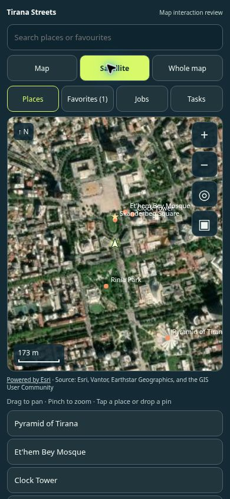

# Tirana Streets: mobile map, combat, flight and AI

This change targets `main` and the portrait Street Career/free-roam experience. Shared weapon presentation, city AI, traffic and battlefield bots receive the same underlying fixes.

## Changes

| Area | Result |
| --- | --- |
| Map | MAP beside MENU at the top; real Esri satellite tiles and vector map; search, pin naming, local favorites, walking/driving destinations, job start and active task panels. Other city guides sit below the main map. |
| HUD | Removes the free-roam objective card and the Arsenal/Holster shortcuts; retains compact health/cash/wanted status and the existing weapon selector. |
| Weapons | Explicit asset axes replace longest-axis sign guessing. Corrects reversed guns and levels the tilted ACR, AR-15, Dragunov and Makarov. The existing optimized FPS shotgun loads within the 20 MB budget; its separately authored arms are hidden. |
| Aiming | Sight/muzzle/ejection coordinates share a complete 3D transform. ADS does not redirect shots with aim assist or camera-only recoil. Scope views use the live scene and matched magnification/sensitivity in Street Career and Battlefield. Muzzle obstruction rays use normalized directions and their actual lengths. |
| Effects | Cylindrical, caliber-sized casings originate at the ejection port. Short tracers and flashes appear on the first rendered frame. Missiles share Ludo's mesh, fire/smoke lobes, recorded launch/impact audio and impact animation; visual instance pools remain bounded. |
| Flight | Smoother throttle, stick dead zone, automatic takeoff assistance, release-to-hover, HOVER and controlled LAND actions. Three roof helicopters plus the jet; each helicopter keeps its own checkpoint identity. |
| Rooftops | Helicopter sites require a 6 m clear radius inside the footprint, including courtyards, and use the highest fitting mapped roofs. Rooftop pools added at Hotel Mondial and Arka Art Hotel. |
| Vehicle impacts | Oriented vehicle footprints against building polygons replace the oversized circular collider and separate bus samples. Courtyards/recesses remain open. Removes double speed damping; normal closing speed, vehicle mass and change of velocity control impulse, damage and occupant injury. Glancing contact preserves tangential movement. |
| AI | Bounded, cached detours for nearby pedestrians and combatants; safe cover selection and squad spacing; friendly firing-lane checks; finite reloads, reachable/unoccupied cover and timestamped searching in Battlefield. Traffic uses projected vehicle dimensions and retains crash impulses before resuming its route. |

## Validation

- Production Vite build and `tsconfig.tirana-gameplay.json` typecheck.
- 70 targeted tests passed across: `tiranaMobileCombat`, `tiranaForceSquads`, `tiranaGameplayOverhaul`, `tiranaDriverBattlefield`, `tiranaGameplayPresentation`, and `tiranaMap`.
- Numeric regressions cover 5 cm near misses, rotated bodies, bus ends, concave footprints/courtyards, scrapes versus head-on impacts, relative velocity and mass, all 41 sight transforms over multiple yaw/pitch angles, four aircraft checkpoint identities, NPC detours, cover/firing-lane behavior, and first-frame/expired effects.
- Browser interaction review at a 390 × 844 frame: satellite imagery loaded; place search, destination routing, favorite save/reload, job selection and the active-task panel worked.
- Inspected CPU projections of the actual geometry for all 41 weapons before and after calibration.

**Live WebGL visual verification remains outstanding.** The available browser reports `GL_VENDOR=Disabled` / `GL_RENDERER=Disabled` and cannot create a WebGL context. CPU geometry projections and numeric checks are not a replacement for a GPU review of textures, scopes, hands, particles, helicopter roofs and flight feel. No claim of a completed per-weapon WebGL audit is made.

`webapp/tirana-combat-review.html` is a development review entry with a portrait map, paged side/ADS WebGL views of every weapon, and the gameplay review frame. Run the normal webapp dev command and open `/tirana-combat-review.html`; review all six weapon pages on a WebGL-capable browser. The review entry is not a production route.

One optional, pre-existing asset test in `tiranaUploadedArsenal.test.mjs` still requests the removed `human` and `operator` player IDs with an empty manifest. The unchanged player catalog accepts only the three supplied, validated player assets. This unrelated fixture is not used as evidence for the new gameplay changes.

## Sources and approximations

- [Hotel Mondial](https://www.hotelmondial.al/) documents a 32 m² pool on its sixth-floor terrace.
- [Arka Art Hotel](https://arkahotel.al/) documents a rooftop infinity pool.
- [Esri World Imagery](https://www.arcgis.com/home/item.html?id=10df2279f9684e4a9f6a7f08febac2a9) provides the satellite tiles. Attribution is displayed with the service's returned credit text; the vector map remains available if tiles fail.

Pool dimensions/deck layouts and roof access are authored approximations fitted to existing game buildings, not a new architectural survey. Aircraft selection uses the game's existing height data. Collision damage remains fictional arcade balancing, with physically motivated impulse and velocity differences.

## Portrait map preview

