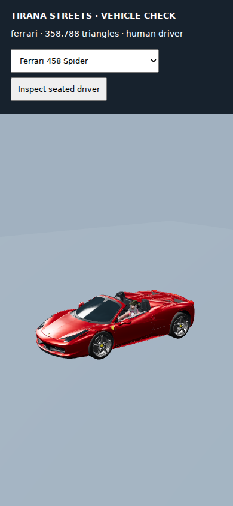
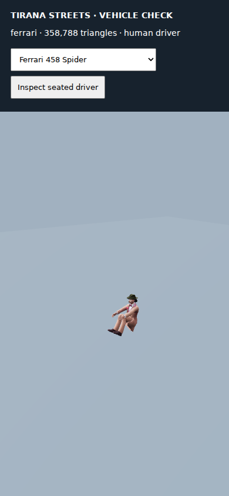

# Original vehicle collection in Tirana Streets

The ten approved Blender GLBs are bundled unchanged in `webapp/public/assets/tirana-streets/vehicle-collection`. SHA-256 and byte-size checks protect their original meshes, UVs, materials and embedded PBR textures. No car is recoloured, resized, decimated or replaced with a lower-detail model. The GLBs already use Draco; the existing local decoder is reused.

| Collection ID | Vehicle |
|---|---|
| benz | Mercedes-Benz S 65 AMG W221 |
| bmw | BMW M3 GT3 |
| range | Range Rover Sport 2018 |
| audi | Audi A8 Custom 2018 |
| ford | Ford Focus |
| fiat | Fiat Punto GT 1995 |
| jaguar | Jaguar I-Pace |
| ferrari | Ferrari 458 Spider |
| bugatti | Bugatti La Voiture Noire 2019 |
| landrover | Land Rover Defender Grasmere |

## In the game

- Operation FPS and City Stories: all ten are parked props with matching full-size collision bounds, using the same placements as the driving world after its origin offset.
- Street Career / driving simulation and Explore: ten parked cars are enterable; the existing 28 civilian traffic vehicles cycle through the ten originals. Service traffic keeps its existing models.
- Mercedes and BMW are on Rruga Dëshmorët e 4 Shkurtit; the other eight are on Rruga Dedë Gjo Luli. Exact positions are in `shared/collectionPlacements.mjs` and are checked against existing buildings, props and spawns.
- Each new car starts with a human NPC driver. The existing Ready Player Me Chess/Table Tennis human gets a private skeleton, bent knees, feet above the floor and arms reaching toward the steering wheel. Seat height/position is configured per vehicle.
- On entering an available parked car, the player takes the driver's seat and the NPC disappears. It remains empty when the player exits. Moving traffic continues to use the existing deterministic simulation.

## Loading and ownership

`CollectionVehicleVisuals` is shared by the existing renderers. It displays the eight nearest collection cars within 180 metres, prioritizes the player's car, shares original mesh/texture resources, runs at most two concurrent loads and uses one Draco worker. Unused sources are evicted; at most four idle sources are retained. All visible cars use the full approved GLB even in battery mode. Culling and deferred loading can make distant cars appear when approached; they never select a lower-quality mesh. The bundled download is approximately 61 MB (58.2 MiB), fetched by model on demand.

Car assets and the human's source resources belong to the cache. Each occupant owns its skeleton only. Disposal aborts outstanding fetches, releases private skeletons and disposes shared sources once. Asset failures are reported by the existing runtime diagnostics.

Keep the [asset attribution and upstream notices](../webapp/public/assets/tirana-streets/vehicle-collection/ATTRIBUTION.md) with redistributions. The original Ford and BMW wheel ShareAlike terms remain attached. The reused human retains its existing game permission; it is not relicensed as CC0.

## Verification

- 15 Node checks passed: exact original asset hashes, embedded materials, presence in both world coordinates, full-size placement clearance, NPC seat handoff, driving/exit and deterministic traffic, plus existing Albanian Forces regressions.
- All ten GLBs loaded and rendered in portrait 390×844 software WebGL using the actual shared vehicle layer and production CSP. Original dimensions and triangle counts were recorded; no page errors or CSP violations occurred.
- The actual Tirana Streets route passed FREE ROAM → ENTER CAR → EXIT CAR through its real UI and simulation. A test-only hook suppresses continuous GPU drawing for this separate UI test; the ten model screenshots use real WebGL renders.
- Focused strict TypeScript checks pass for `CollectionVehicleVisuals.ts` and `NpcVehicleDriver.ts`. A broader integration check still reports the existing `Effect.y` diagnostic in unchanged `AirMobilityVisuals.ts` and the pre-existing `RoomEnvironment(renderer)` constructor mismatch in `cityBaseRenderer.ts`.
- The production Vite bundle passed (`node webapp/scripts/run-vite-build.mjs`, 27.76 seconds). The full npm prebuild did not finish: the existing importer was still downloading the unrelated Smith/SigSauer assets when its network approval was cancelled by the execution environment. The new ten-car verifier itself passes without network access.
- Screenshots and machine-readable results are in [validation/tirana-vehicle-collection](validation/tirana-vehicle-collection). These checks do not establish frame rates on a physical phone or test a live multiplayer room.

Run from the repository root, with existing dependencies installed:

```sh
node webapp/scripts/verify-vehicle-collection.mjs
node --test test/tiranaVehicleCollection.test.mjs test/tiranaAlbanianForces.test.mjs test/tiranaBattlefieldForces.test.mjs test/tiranaAlbanianForcesRuntime.test.mjs
node test/tiranaVehicleCollection.browser.mjs
node test/tiranaVehicleCollection.game-browser.mjs
```

The browser scripts use Playwright Chromium. Set `PLAYWRIGHT_CHROMIUM_EXECUTABLE_PATH` only if using a separately installed browser. The existing `predev`/`prebuild` step supplies the local Draco decoder. Both browser tests start their own local server, bundle the real game modules and use the backend's current Content Security Policy. `node test/serveTiranaVehicleCollection.mjs` also opens a manual review server: `/` shows the collection inspector and `/game?activity=street-career&mode=ai` mounts the actual game route.



