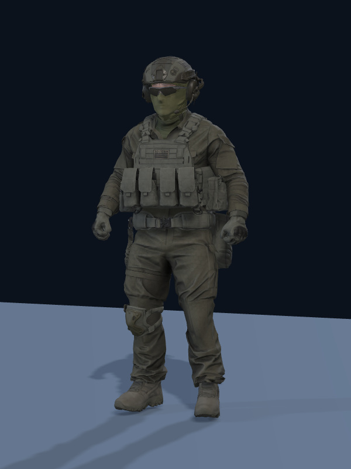
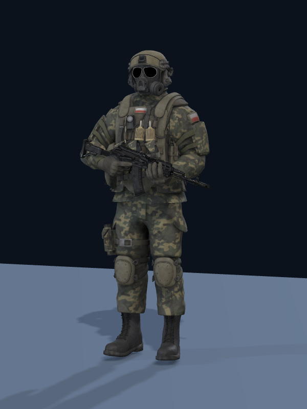
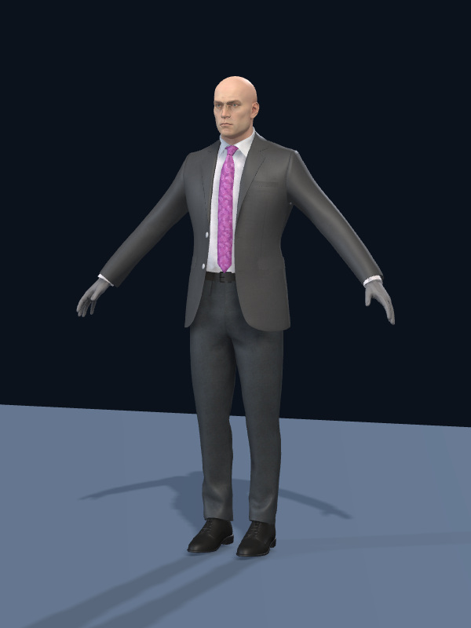

# Tirana Streets: three supplied players

This follow-up to merged PR #25934 replaces the five preview-only entries and
default-operator bypass with exactly the three files supplied by the user.

| Choice | Source author | License |
| --- | --- | --- |
| Tactical Soldier | DanlyVostok | CC BY 4.0 |
| Polish Soldier | buh | CC BY 4.0 |
| Agent 47 | Veterock | CC BY-NC 4.0 |

Source URLs, original notices, modifications, and input/output hashes are recorded
in `webapp/public/assets/tirana-streets/players/ATTRIBUTION.txt`, the original Agent
license, and `asset-audit.json`. Agent 47 requires permission for commercial use;
this draft does not establish that permission. Its supplied archive has a skeleton
but no animation clips or morph targets, despite the archive title.

## Player selection and body integration

- The portrait player picker appears before the lobby and also guards direct game
  routes. It renders the actual selected GLB with orbit/pinch controls. Continue is
  enabled only after that model loads, passes rig validation, and renders.
- Exactly Tactical Soldier, Polish Soldier and Agent 47 are selectable. Loading
  errors have Retry and Back actions; a different actor is never substituted.
- Career, Battlefield/online and City Stories use the selected body. City Stories
  keeps its existing unarmed exploration. Online gameplay input stays blocked until
  the selected body and starting weapon finish loading.
- Audited aliases cover Character Creator, Polish numbered bones and Mixamo names.
  Source names, transforms, skin weights, geometry and authored animations remain
  intact. Shared body code supplies weapon grips, first-person head masking and
  procedural footsteps for bodies without locomotion clips.
- The Polish model's authored rifle is hidden in gameplay so it does not overlap
  equipped weapons. Its separate uniform magazines remain visible.
- Only one preview model/WebGL context is active at a time; selection changes and
  leaving the picker dispose it. Context loss cannot unlock Continue.

## Assets and downloads

The three optimized GLBs embed all textures and buffers and require no special
compression decoder. Texture derivatives reduce phone memory and download sizes;
the original uploads remain unchanged. The existing Tirana pack includes this
asset directory, and the production pack also includes the executable runtime and
shared dependencies.

The earlier PR's aircraft boarding/landing fixes, emergency vehicle theft,
collision response, shared player/NPC shot tests, tracer/effect changes, and
resumable complete-download checks remain on main. Downloads use browser/PWA
storage; account and multiplayer services still require a network.

Reproduce asset preparation using `webapp/scripts/prepare-tirana-player-assets.py`.
After generating each GLB, update its manifest with:

```sh
node webapp/scripts/import-tirana-player.mjs tactical webapp/public/assets/tirana-streets/players/tactical.glb
node webapp/scripts/import-tirana-player.mjs polish webapp/public/assets/tirana-streets/players/polish.glb
node webapp/scripts/import-tirana-player.mjs agent-47 webapp/public/assets/tirana-streets/players/agent-47.glb
```

`rigValidated` records structural compatibility, not human visual sign-off. The
tests additionally load the actual three GLBs and check scaling, bone mapping,
head masking, grip error, walking/crouching and selection readiness. Static
portraits are rendered from the actual skinned models with Mesa EGL; they are not
screenshots of gameplay.

## Review gates

The PR remains a draft until commercial permission for Agent 47 and final device
review are resolved. Inspect all three bodies, weapon switching, crouch, reload,
head clipping, and repeated enter/exit in portrait WebGL on a physical phone.
Measure frame time and texture memory, then install the production game pack and
reopen offline, including after dependency eviction.

Live browser verification of this checkout was blocked by preview-server network
isolation; exposing the server was rejected by environment approval policy. No
claim of completed live-game WebGL or physical-device QA is made.

## Actual-model portraits

| Tactical Soldier | Polish Soldier | Agent 47 |
| --- | --- | --- |
|  |  |  |
